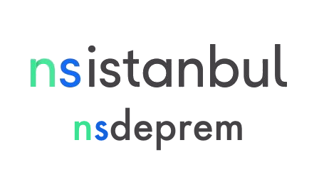
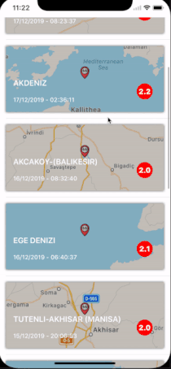
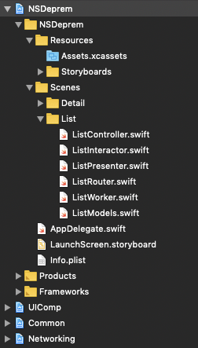

# NSDeprem

Purpose of the project
======================

:boom: This is the demo app which has a list of newest earthquakes in Turkey for NSIstanbul presentation about Vapor Server-Side Swift.

#### Powered by [Kandilli Rasathanesi ve Deprem Arastirma Enstitusu](http://m.koeri.boun.edu.tr/dbs3/) :star: 

## Tech-stack :calling:

* [Clean Swift Architecture](https://hackernoon.com/introducing-clean-swift-architecture-vip-770a639ad7bf)

  * :fire: You can create the Clean Swift Architecture's files effortlessly with this [repo](https://github.com/emrcftci/clean-swift-architecture-file-template) :fire:

* [Modular Architecture](https://www.youtube.com/watch?v=tSXFjpio5MA)

* [Swift 5](https://github.com/apple/swift)

* [Cache Mechanism - NSCache](https://www.hackingwithswift.com/example-code/system/how-to-cache-data-using-nscache)

### TODO :clipboard:

- [ ] Unit tests to be added
- [ ] Increase performance

Thanks for your support!! :trollface:
======================

:arrow_right: [Ali Can Batur]()

Find this repo useful?
======================

Find this repo useful? :heart: 

Support it by joining [stargazers](https://github.com/emrcftci/NSDeprem/stargazers) for this repository. :star:

You can follow us for our next creations! 🤩

* [Ahmet Dogu](https://github.com/vicaren)

* [Emre Ciftci](https://github.com/emrcftci)

License
=======

[Apache License 2.0](https://github.com/emrcftci/NSDeprem/blob/master/LICENSE)